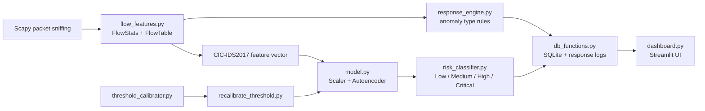

# AI-Powered Preventative Server Security System

A local intrusion-detection dashboard that captures live server traffic, groups packets into flows, scores each flow with a trained PyTorch autoencoder, classifies risk, and stores actionable alerts in SQLite.

## What It Does

This project acts like a lightweight security monitor for a server or workstation. It watches IPv4 traffic, converts packet flows into CIC-IDS2017-style numeric features, and flags flows whose reconstruction error is higher than the learned normal baseline.

When traffic looks unusual, the system can:

- assign a risk level: `Low`, `Medium`, `High`, or `Critical`
- infer an anomaly family such as `SYN_FLOOD`, `PORT_SCAN`, `SSH_BRUTE_FORCE`, `WEB_ATTACK`, or `DNS_AMPLIFICATION`
- write a live alert to `app/logs/live_alerts.txt`
- store non-low alerts in `app/threat_memory.db`
- create full response logs for High and Critical alerts in `app/logs/response_logs/`
- show authentication, live IDS controls, alert history, metrics, and threshold calibration in Streamlit
- track Low-risk event count separately for false-positive-rate calculations

## How It Works

The detection pipeline has five main stages:

1. **Database and artifacts**
   - `app/schema.py` creates the SQLite tables used by alerts, users, user thresholds, calibration sessions, and aggregate metrics.
   - `app/artifacts/` stores the trained model, scaler, base threshold, and feature column order.

2. **Packet capture**
   - `app/live_capture.py` uses Scapy to sniff IPv4 traffic from a selected network interface.
   - `app/flow_features.py` groups packets into flows using a normalized 5-tuple: source IP, destination IP, source port, destination port, and protocol.

3. **Feature extraction**
   - Each flow is converted into CIC-IDS2017-style features.
   - Features include packet counts, byte totals, flow duration, packet length statistics, TCP flags, inter-arrival timing, packet rates, header lengths, active/idle times, and TCP window sizes.

4. **ML anomaly scoring**
   - A PyTorch autoencoder reconstructs the scaled feature vector.
   - The mean squared reconstruction error becomes the anomaly score.
   - `app/model.py` centralizes the shared autoencoder architecture, artifact loading, feature alignment, and scoring helpers.
   - `app/risk_classifier.py` maps that score into risk tiers with saved or fallback thresholds.

5. **Response and persistence**
   - `app/response_engine.py` applies rule-based network logic to infer the anomaly type.
   - `app/db_functions.py` writes non-low alerts to SQLite and writes response-log text for High/Critical alerts.
   - `app/dashboard.py` reads SQLite and log files for the Streamlit UI.

## Architecture



## Dashboard

The Streamlit dashboard includes:

- **Login/Register** - local users stored in SQLite with bcrypt password hashes
- **Live Events** - start/stop controls for `live_capture.py` and a live alert feed
- **Risk Indicators** - Medium, High, and Critical alert totals
- **Historical Logs** - expandable stored alert details and response-log viewer
- **Metrics** - total stored alerts, unique source IPs, repeated IP count, and latest detection
- **Threshold Adjuster** - per-user live calibration that runs `app/recalibrate_threshold.py` in the background

The dashboard is local only. It is not a hardened multi-user web service and should not be exposed directly to the internet.

## Project Structure

```text
.
|-- app/
|   |-- auth.py                    # SQLite-backed registration/login helpers
|   |-- autoencoder.py             # trains the production autoencoder artifacts
|   |-- check_features.py          # prints trained feature column names
|   |-- dashboard.py               # Streamlit dashboard
|   |-- db_functions.py            # SQLite read/write helpers
|   |-- diagnose_features.py       # live feature/scoring diagnostic CLI
|   |-- false_positives.py         # normal-window false-positive analysis
|   |-- flow_features.py           # shared packet-flow aggregation + feature extraction
|   |-- live_capture.py            # main live IDS packet capture and scoring runner
|   |-- live_capture_manager.py    # dashboard subprocess manager for live_capture.py
|   |-- model.py                   # shared autoencoder architecture + artifact scoring
|   |-- paths.py                   # centralized app paths and test overrides
|   |-- recalibrate_threshold.py   # live benign threshold recalibration CLI
|   |-- response_engine.py         # anomaly type and mitigation recommendation rules
|   |-- risk_classifier.py         # reconstruction error -> risk tier
|   |-- schema.py                  # SQLite schema creation and reset prompt
|   |-- threshold_calibrator.py    # dashboard background calibration session manager
|   |-- true_positives.py          # attack-window true-positive analysis
|   |-- artifacts/                 # trained model, scaler, threshold, feature columns
|   `-- diagrams/                  # training/evaluation plots
|-- attacks/
|   `-- attack_cmd.bat             # Windows command reference for manual attack tests
|-- .github/workflows/
|   `-- ci.yml                     # fast syntax + unit-test checks for PRs
|-- test/
|   |-- data/                      # CIC-IDS2017 CSVs and synthetic data generator
|   |-- simulations/               # Scapy traffic simulators and objective verification
|   |-- test_integration.py        # end-to-end unit/integration tests
|   |-- test_response_engine.py    # response rule unit tests
|   `-- test_risk_classifier.py    # risk tier unit tests
|-- clear_events.py                # clears app/threat_memory.db alert tables
|-- Makefile                       # setup, test, lint, dashboard, live shortcuts
|-- requirements.txt               # Python dependency recipe
`-- README.md
```

## Requirements

- Python 3.10 to 3.12 recommended
- macOS, Linux, or Windows
- Admin/root privileges for live packet capture
- Npcap on Windows when using Scapy packet capture
- Existing trained artifacts in `app/artifacts/`

Install the Python packages from `requirements.txt`. The app uses Scapy for packet capture, PyTorch for the autoencoder, SQLite for local storage, and Streamlit for the UI.

## Setup

From the repository root:

```bash
python3 -m venv .venv
source .venv/bin/activate
pip install -r requirements.txt
```

On Windows PowerShell:

```powershell
python -m venv .venv
.\.venv\Scripts\Activate.ps1
pip install -r requirements.txt
```

Do not commit `.venv/`. It is local machine state and can be recreated from `requirements.txt`.

Common developer shortcuts:

```bash
make setup       # create .venv and install packages
make lint        # compile all Python files without writing repo pycache
make test-fast   # run dependency-light unit tests
make test        # run pytest discovery
make dashboard   # start Streamlit dashboard
```

## Run The Dashboard

The dashboard can start and stop the IDS process from the **Live Events** tab:

```bash
cd app
../.venv/bin/streamlit run dashboard.py
```

On Windows:

```powershell
cd app
..\.venv\Scripts\streamlit run dashboard.py
```

Open the local Streamlit URL if the browser does not open automatically:

```text
http://localhost:8501
```

Create a local account from the Register tab, then sign in. The account is stored in `app/threat_memory.db`.

## Run The Live IDS Directly

Run the live detector directly:

```bash
sudo ./.venv/bin/python app/live_capture.py
```

On Windows, run the terminal as Administrator:

```powershell
.\.venv\Scripts\python app\live_capture.py
```

Useful options:

```bash
# Choose a specific network interface
sudo ./.venv/bin/python app/live_capture.py --iface en0

# Stop after 60 seconds
sudo ./.venv/bin/python app/live_capture.py --timeout 60

# Save captured packets to app/live.pcap
sudo ./.venv/bin/python app/live_capture.py --pcap

# Print top scaled feature outliers for each scored flow
sudo ./.venv/bin/python app/live_capture.py --debug

# Skip auto-launching Streamlit
sudo ./.venv/bin/python app/live_capture.py --no-dashboard
```

To stop the app, press `Ctrl+C` in the terminal running `live_capture.py`.

## Database Reset Prompt

When `live_capture.py` starts and `threat_memory.db` already exists, the app asks whether to reset data:

- `no` - keep the existing database and logs
- `table` - drop application tables and clear logs, with an option to preserve users, thresholds, or both
- `database` - delete the database and logs completely

Use `no` when you want to keep historical alerts. Use `--no-reset` only for automation or when the dashboard launches the IDS for you.

## Threshold Calibration

The threshold adjuster learns a local baseline from known-good live traffic. It is useful when the original training threshold is too sensitive for your network.

Dashboard path:

```text
Login -> Threshold Adjuster -> Run Threshold Adjuster
```

CLI path:

```bash
cd app
sudo ../.venv/bin/python recalibrate_threshold.py --timeout 240
```

Optional interface and percentile:

```bash
sudo ../.venv/bin/python recalibrate_threshold.py --iface en0 --timeout 240 --percentile 99
```

Calibration saves the user threshold in SQLite and writes the current base threshold to `app/artifacts/threshold.pkl`. Restart `live_capture.py` after calibration so the detector loads the new value.

## Runtime Paths

Runtime paths are centralized in `app/paths.py`. Normal runs use:

- database: `app/threat_memory.db`
- logs: `app/logs/`
- artifacts: `app/artifacts/`
- training data: `app/data/`

Tests and automation can override those paths with:

```bash
IDS_DB_PATH=/tmp/ids.db
IDS_LOGS_DIR=/tmp/ids-logs
IDS_ARTIFACTS_DIR=/path/to/artifacts
IDS_DATA_DIR=/path/to/csvs
```

## Diagnostics

Print the trained feature list:

```bash
cd app
../.venv/bin/python check_features.py
```

Inspect live feature deviations and reconstruction-error contributors:

```bash
cd app
sudo ../.venv/bin/python diagnose_features.py --timeout 60 --maxflows 5
```

Clear stored threat events:

```bash
./.venv/bin/python clear_events.py
```

Analyze saved alert windows. Edit the hard-coded Puerto Rico local time windows in each file first:

```bash
cd app
../.venv/bin/python true_positives.py
../.venv/bin/python false_positives.py
```

## Manual Smoke Test

After launching the IDS, generate harmless traffic in another terminal:

```bash
ping -c 10 1.1.1.1
for i in {1..20}; do curl -s https://example.com >/dev/null; done
```

Then check:

- **Live Events** updates within a few seconds
- **Historical Logs** shows stored non-low alerts if any were detected
- High/Critical events have response logs
- Low-risk traffic increments the Low-risk metric but does not create a `threat_events` row

You can inspect SQLite directly:

```bash
cd app
sqlite3 threat_memory.db "SELECT id, timestamp, IP, anomaly_type, risk_level, recon_error FROM threat_events ORDER BY id DESC LIMIT 10;"
```

## Tests

Fast tests:

```bash
./.venv/bin/python test/test_risk_classifier.py
./.venv/bin/python test/test_response_engine.py
# or
make test-fast
```

Integration tests:

```bash
./.venv/bin/python -m pytest test/test_integration.py -v
```

Full test discovery:

```bash
./.venv/bin/python -m pytest test -v
```

Some simulation and objective tests require administrator/root privileges, packet-capture support, and platform-specific loopback interfaces.

GitHub Actions runs the fast syntax and unit-test checks on pushes and pull requests to `main`.

## Simulations

The `test/simulations/` folder contains Scapy-based traffic generators for controlled IDS testing:

- `sim_unusual_login.py` - SSH brute-force style login attempts
- `sim_privilege_escalation.py` - privileged service probing
- `sim_lateral_movement.py` - ICMP sweep plus TCP service enumeration
- `sim_data_exfiltration.py` - large asymmetric outbound TCP flows
- `sim_abnormal_process.py` - C2 beacon, URG-flag abuse, and DNS burst patterns
- `run_all_simulations.py` - runs the five scenarios in sequence
- `test_all_objectives.py` - verifies detection rate, false-positive rate, alert latency, and interpretability objectives

Run simulations only in a lab environment you control. Most scripts default to loopback traffic.

Example:

```bash
cd test/simulations
sudo ../../.venv/bin/python run_all_simulations.py --iface lo --gap 10
```

## Training And Artifacts

The repository includes trained artifacts in `app/artifacts/`:

- `autoencoder_model.pth`
- `scaler.pkl`
- `threshold.pkl`
- `feature_columns.pkl`

`risk_thresholds.pkl` may also be produced by training or objective calibration. If it is missing, `app/risk_classifier.py` derives Medium/High/Critical thresholds from `threshold.pkl`.

To retrain:

```bash
cd app
../.venv/bin/python autoencoder.py
```

`app/autoencoder.py` expects CIC-IDS2017 CSV files under `app/data/` by default. The repository tracks CSV data under `test/data/`; copy or symlink those files into `app/data/`, or update `dataset_files` in `autoencoder.py` before retraining.

Generated artifacts must remain compatible with `app/model.py`, `live_capture.py`, `diagnose_features.py`, and `recalibrate_threshold.py`, especially the model architecture and `feature_columns.pkl` order.

## Troubleshooting

**`sudo` asks for a password**

Packet sniffing usually requires admin/root privileges. Type your macOS/Linux user password. The terminal will not show characters while you type.

**No alerts appear**

Low-risk traffic is written to the Low-risk metric, not to the historical anomaly table. Try running longer, selecting the correct interface, lowering `--minpkts` for testing, or using `--debug` to inspect feature scoring.

**Streamlit does not open**

Open `http://localhost:8501` manually, or run:

```bash
cd app
../.venv/bin/streamlit run dashboard.py
```

**Wrong interface**

Use Scapy to list interfaces, then pass the selected one with `--iface`. Common examples are `en0` on macOS, `eth0` or `wlan0` on Linux, and `\Device\NPF_Loopback` for Windows loopback with Npcap.

**Everything looks anomalous**

Run the feature diagnostic first:

```bash
cd app
sudo ../.venv/bin/python diagnose_features.py --timeout 60
```

If the traffic is known-good, run threshold calibration and restart live capture.

**Dependency errors**

Recreate the virtual environment:

```bash
rm -rf .venv
python3 -m venv .venv
source .venv/bin/activate
pip install -r requirements.txt
```
